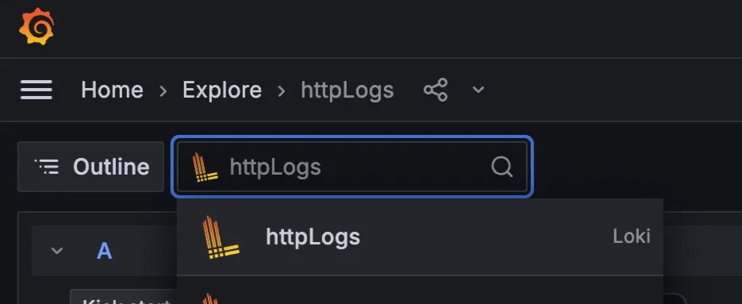

# Logbook — Evolving Distributed Tracing & Observability 🚀

## 🧠 Why HTTP Logs Matter

In our distributed microservices, **every request counts** — but without HTTP logs:

- We can't trace **failures across services**
- Debugging becomes **guesswork**
- Sensitive data may be logged **inconsistently**
- It's hard to **correlate** with tracing systems

## ✅ Our Solution: Logbook via `platform-sdk`

We've standardized HTTP logging using **Logbook**, bundled inside our internal **`platform-sdk`**.

### What it gives you:

- Logs **method, http path, status, body, type, http method**
- Adds `trace_id`, `ipAddress`, `bazaarClientKey`, `userId`
- Automatically redacts sensitive data
- Sends all logs to **Grafana Loki** → tenant: `httplogs`
- Integrates with distributed tracing (Tempo, OpenTelemetry)

## 🪄 Benefits to You

| Benefit | What It Means |
| --- | --- |
| 🔍 Faster debugging | See full request/response payloads, instantly spot issues |
| 🧵 End-to-end tracing | Follow a request across services using `trace_id` |
| 🛡 Secure by default | Redacts fields like `refreshToken`, `token`, `Authorisation` |
| ⚙️ Zero setup | Works out-of-the-box with the Platform SDK |
| 🔄 Configurable | Toggle redaction/masking via GitOps config in real-time — no CI |

## ⚙️ How to Enable HTTP Logs in Your Microservice

Logbook is available via `platform-sdk` **v5.3.2**. To enable HTTP logging:

### ✅ 1. Add `platform-sdk` dependency — version 5.3.2

Already included:

```xml
<dependency>
    <groupId>com.bazaar</groupId>
    <artifactId>platform-sdk</artifactId>
    <version>5.3.2</version>
</dependency>
```

### ✅ 2. Annotate Your Main Application

In your `@SpringBootApplication` class, add:

```java
@SpringBootApplication
@EnableHttpLogs
public class MyServiceApplication {
    public static void main(String[] args) {
        SpringApplication.run(MyServiceApplication.class, args);
    }
}
```

### ✅ 3. Set Log Level for Logbook

In `application.yml` :

```yaml
logging:
  level:
    org:
      zalando:
        logbook:
          Logbook: TRACE
```

### ✅ 4. How to Enable or Disable Redaction

You must set the following env var **in your container spec**:

```yaml
- name: HTTPLOG_REDACTION_ENABLED
  value: "true"   # or "false"
```



### 📌 Behavior

| Value | Result |
| --- | --- |
| `"true"` | Redacts sensitive fields like `refreshToken`, `token`, `Authorization` |
| `"false"` | Shows full request/response payloads (use only in dev or debug scenarios) |

### ✅ 5. Deploy & Verify in Loki

Logs will appear in **Grafana Loki**, tenant: `httplogs`


## 🔍 Example: Filter Logs for a Specific Service

Let's say you want to view all **`POST` requests to `/v3/auth/otp/signup/generate`** with status **200** and of type **response**.

### ✅ LogQL Query:

```json
{service="order-service", httpMethod="POST", httpPath="/v3/auth/otp/signup/generate", type="response", status="200"}
```

## 🛠️ Tips for Building Queries

### 🔎 1. **Filter by HTTP Method**

```json
{service="order-service", httpMethod="GET"}
```

### 📍 2. **Filter by Path Prefix (Fuzzy Search)**

If exact match doesn't work (e.g., dynamic path values), use `|~` for regex:

```json
{service="order-service", type="response"} |~ "/v3/auth/otp/.*
```

### 🧵 3. **Filter by Status Code**

```json
{service="order-service", status="500"}  // See internal errors
```

### 🧪 4. **Only Show Request Logs**

```json
{service="order-service", type="request"}
```

### 🔍 5. **See All Logs for a Given Trace**

```json
{service="order-service", trace_id="8be8acdf485a541a9234024822e50334"}
```

---

## 🔁 Combine Multiple Filters

Example: All failing `POST` requests to auth endpoint:

```json
{service="order-service", httpMethod="POST", httpPath="/v3/auth/otp/verify", status=~"4..|5.."}
```