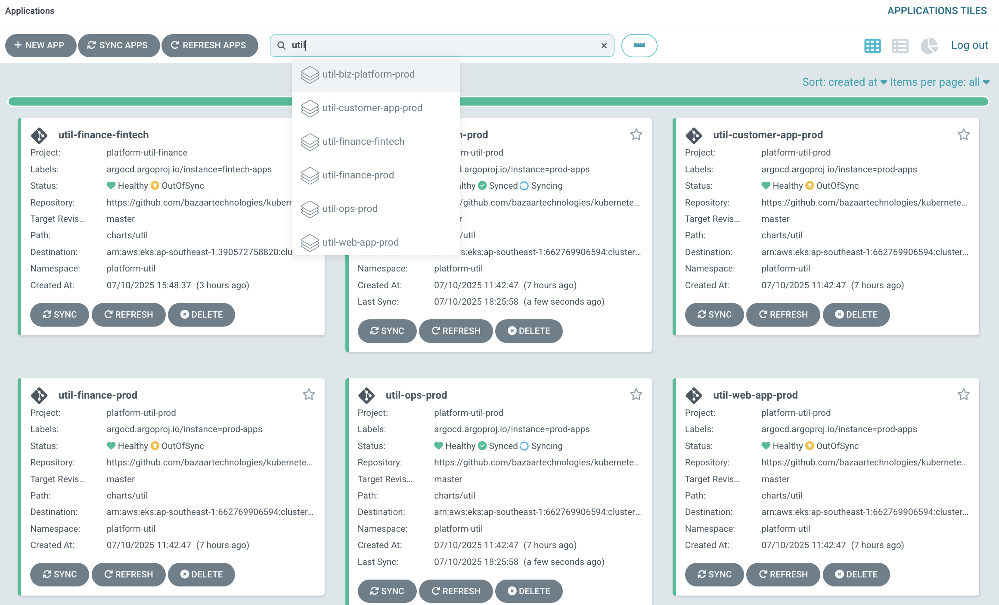
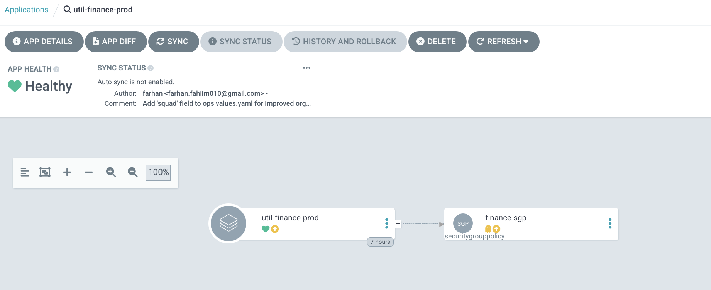
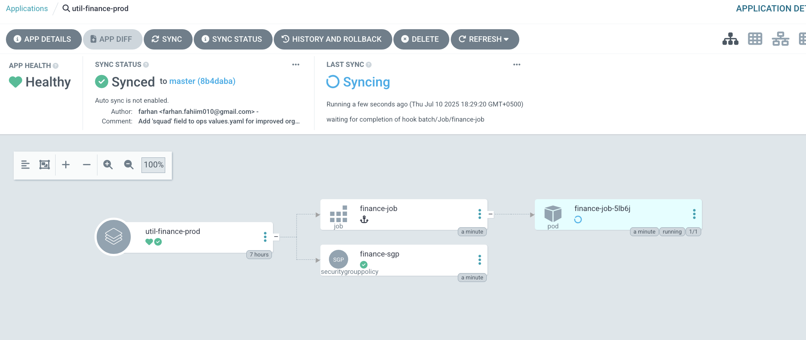
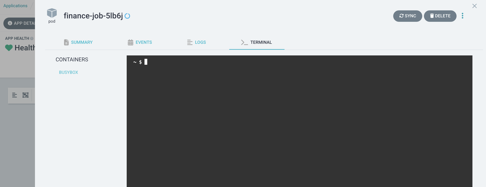
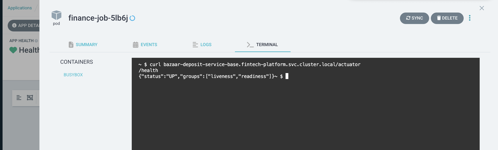

# Platform Shell Utility 🛠️

A secure way to call internal APIs within our EKS clusters without exposing them publicly.

## 🎯 Overview

The Platform Shell Utility provides developers with a secure method to access internal APIs that are not exposed through our public API gateway. Instead of making these development/debugging endpoints public, we leverage ArgoCD's web-based terminal to execute API calls directly from within the cluster network.

## 🔍 Why Use This Tool?

- **Security First**: Keep internal APIs private and secure
- **Network Access**: Call services that are only accessible within the cluster network
- **No Gateway Exposure**: Avoid exposing debug/internal endpoints publicly
- **Easy Access**: Simple web-based interface through ArgoCD

## 📋 Prerequisites

- Access to ArgoCD dashboard
- Knowledge of the target service's squad and cluster location

## 🚀 Step-by-Step Guide

### Step 1: Access ArgoCD
1. Navigate to your ArgoCD dashboard
2. Ensure you have the necessary permissions to access utilities

### Step 2: Find the Appropriate Utility
1. In the ArgoCD search bar, type `util`
2. You'll see multiple utility applications following this naming pattern:
   ```
   util-{squad}-{cluster}
   ```
   
   **Examples**: 
   - `util-finance-fintech` (finance squad, fintech cluster)
   - `util-finance-prod` (finance squad, prod cluster)
   - `util-biz-platform-prod` (biz-platform squad, prod cluster)



### Step 3: Select Your Target Utility
Choose the utility that matches your service's squad and cluster:
- Identify your service's squad (e.g., `finance`, `biz-platform`, `customer-app`, `web-app`, `ops`)
- Identify your service's cluster:
  - **Finance squad**: `fintech` or `prod`
  - **All other squads**: `prod` only
- Click on the corresponding utility application

### Step 4: Sync the Utility
1. Click the **Sync** button to start a new session
   
   

2. Wait for the blue progress indicator - this means your 5-minute session has started
   
   

### Step 5: Access the Terminal
1. Click on the pod to switch to the terminal tab
   
   

### Step 6: Execute Your API Call
Now you can run curl commands to call internal services. Use the following format:

```bash
curl {service-name}.{namespace}.svc.cluster.local/{endpoint}
```

**Example**:
```bash
curl bazaar-lending-service-base.lending-platform.svc.cluster.local/actuator/health
```



## 📝 Important Notes

### Service Naming Convention
- Services follow the pattern: `{service-name}.{namespace}.svc.cluster.local`
- Always verify your service is running in the correct namespace and cluster
- Use the appropriate utility for your target service's location

### Understanding Kubernetes East-West URLs

The URL pattern `{service-name}.{namespace}.svc.cluster.local` is a **Kubernetes DNS name** used for internal service-to-service communication within the cluster (also known as "east-west" traffic).

**URL Breakdown**:
```
service-name.namespace.svc.cluster.local
    │         │        │    │
    │         │        │    └── Cluster domain (default: cluster.local)
    │         │        └─────── Service type indicator
    │         └───────────────── Kubernetes namespace
    └─────────────────────────── Service name
```

**Example**: `bazaar-lending-service-base.lending-platform.svc.cluster.local`
- `bazaar-lending-service-base` = Service name
- `lending-platform` = Namespace where the service is deployed
- `svc` = Indicates this is a Kubernetes Service
- `cluster.local` = Default cluster domain

**Why This Works**:
- Kubernetes has an internal DNS server that resolves these names
- Services within the same cluster can communicate using these DNS names
- No need for external IPs or load balancers for internal communication
- Provides service discovery and load balancing automatically

### Session Management
- Each session lasts **10 minutes**
- Sessions automatically expire for security
- You can start a new session by syncing again

### Supported Squads and Clusters
Make sure to use the correct utility for your service:

**Finance Squad (Multiple Clusters)**:
- **finance/fintech**: Use `util-finance-fintech`
- **finance/prod**: Use `util-finance-prod`

**Rest Squads (Prod Cluster Only)**:
- **biz-platform/prod**: Use `util-biz-platform-prod`
- **customer-app/prod**: Use `util-customer-app-prod`
- **web-app/prod**: Use `util-web-app-prod`
- **ops/prod**: Use `util-ops-prod`

## 🔧 Common Use Cases

### Health Checks
```bash
# Finance squad service example in fintech
curl service-name-base.lending-platform.svc.cluster.local/actuator/health

# Rest squad service example in prod
curl service-name-base.customer-platform.svc.cluster.local/actuator/health
```

### API Testing
```bash
# Business platform service
curl -X POST service-name-base.biz-platform.svc.cluster.local/api/endpoint \
  -H "Content-Type: application/json" \
  -d '{"key": "value"}'
```

## ❓ Troubleshooting

### Common Issues

**Service Not Found (404)**
- Verify the service name and namespace
- Check if the service is running in the expected cluster
- Ensure you're using the correct utility for the target squad

**Connection Timeout**
- Confirm the service is healthy and running
- Check if you're in the correct network namespace
- Verify the service port (default is usually 5000)

**Session Expired**
- Sessions last only 10 minutes
- Simply sync the utility again to start a new session

## 🔐 Security Considerations

- Sessions are time-limited for security
- Only internal cluster services are accessible
- No external internet access from utility pods

---

**Need Help?** Contact the Platform Team or check our internal documentation for more specific use cases.