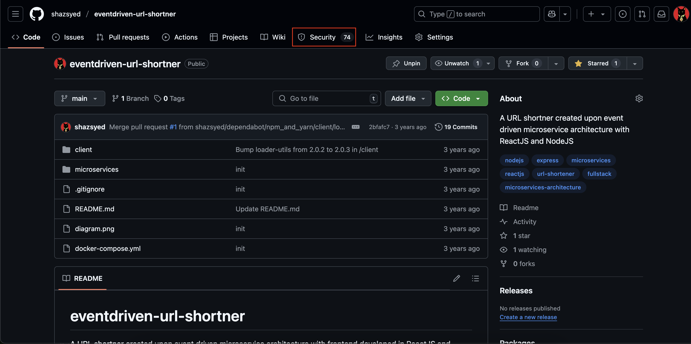
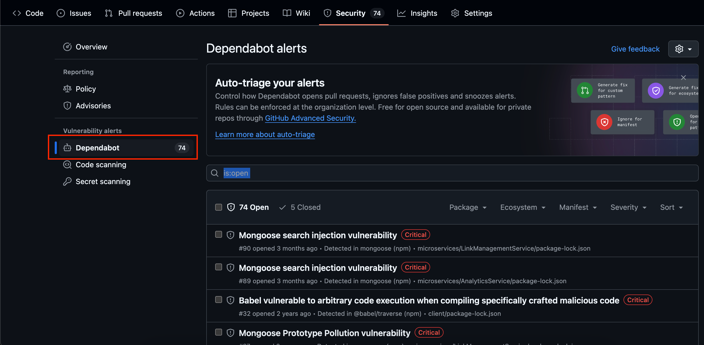
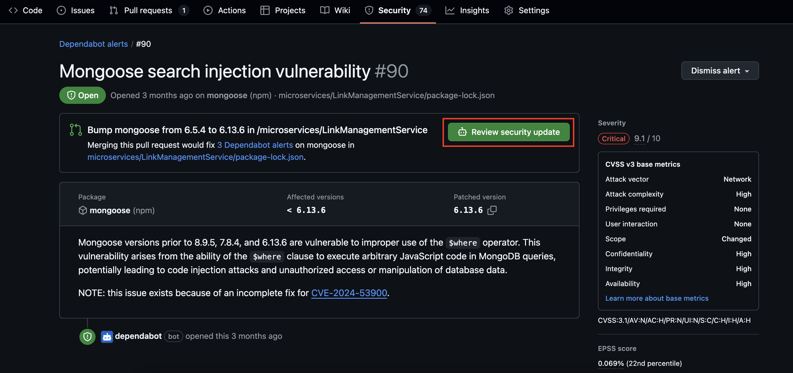
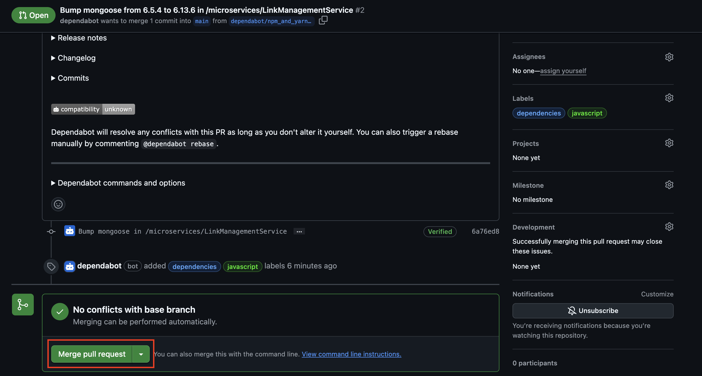

# Dependabot 

#### Introduction

Dependabot is an automated dependency management tool that helps keep project dependencies up to date. It scans repositories for outdated dependencies and security vulnerabilities, automatically generating pull requests for updates, all at no additional cost.

#### Why use Dependabot ?

- Ensures security by fixing vulnerable dependencies.
- Keeps software up to date with the latest versions.
- Reduces manual effort in dependency management.

#### How Dependabot works ?

- Checking for outdated dependencies in your repository.
- Creating automated pull requests for updates.
- Alerting about security vulnerabilities in dependencies.
- Allowing customization via `.github/dependabot.yml`.

#### Developer Guide

Dependabot automatically creates security issues, and as a developer, it's your responsibility to merge the corresponding pull requests—especially those addressing **Critical and High severity** vulnerabilities. 

1. Visit the repository and click on security tab.

    

2. To view all the security issues created by dependabot

    

3. After selecting the security issue that you want to fix, click on **Review security update** to view the PR.

    

4. Merging the PR will automatically resolve the issue via Dependabot.

    