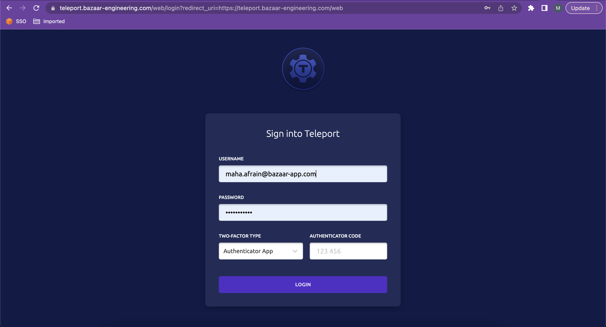

# Teleport Playbook

**How to request for Teleport’s access?**

Create a ticket on [ITA board](https://bazaar.atlassian.net/jira/software/projects/ITA/boards/22) and mention your role for teleport’s access.

Let any one of our team members’ know, they shall process your request and provide you with a link that needs to be configured as soon as you get it, since it has a short expiration time.

**Note:** use ***Google Authenticator App*** in your mobile ***to configure MFA***. Teleport does not have support for Microsoft Authenticator.

Once you configure teleport, you may log in and navigate to Applications tab to find Watchman, SonarQube and other apps. From there, click on Launch and the respective application will open. If you are using it for the first time you will have to request for the app’s user creation and login with the new credentials that you set. Again, make sure you request for the access when you can configure it ASAP.

**FAQs for Watchman:**

Q. Where can I customize/edit queries to find logs?

A. If you want to find logs and write your own queries to search in logs, navigate to Dashboards and click for Browse. Look for “Observability Explorer” dashboard. This dashboard has edit rights where you can customize the queries to find desired logs.

DO NOT save or apply on these dashboards.

Q. Grafana is not opening.

A. Login to Teleport first then launch Grafana.